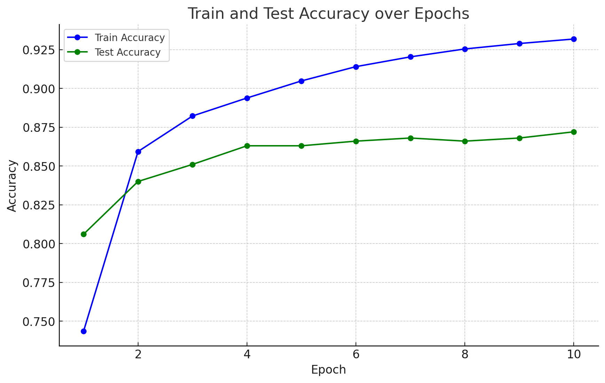

* * *

Fully Connected Neural Network in C
===================================

Overview
--------

This project is a 2 layer fully connected neural network implemented from scratch in C. The network is designed to train on the MNIST dataset, a collection of handwritten digits, however and it can be adapted to a wide variety of data with minor changes in code. The network is capable of achieving high accuracy on both training and test data. The project showcases how low-level programming in C can be used to build a fundamental machine learning model, complete with custom matrix operations, a complete forward and backward pass, file handling, and command-line argument parsing from scratch.

Features
--------

*   **Low-Level Implementation**: The project demonstrates core machine learning concepts without relying on high-level libraries, focusing on how neural networks work under the hood. Espacially, the backprogataion code is neatly commented for a better understanding.
*   **Custom Matrix Operations**: Handcrafted matrix operations to handle the necessary computations for the neural network.
*   **Flexible Command-Line Interface**: Allows users to customize hyperparameters and paths through command-line arguments using `getopt`.
*   **Progress Logging**: Training progress and accuracy can be logged to a file for later analysis.
*   **Model Saving**: The best model during training is saved based on test accuracy, ensuring that the most accurate model is preserved.

File Structure
--------------

*   **`main.c`** : Main driver code, handling command-line arguments, data loading, training, and saving the network.
*   **`ffNN/nn.c` & `ffNN/nn.h`** : Implements the neural network, including functions for training, optimization algorithm, saving, and loading the model.
*   **`matrix/matrix.c` & `matrix/matrix.h` & `matrix/matrixOps.c` & `matrix/matrixOps.h` ** : Provides the matrix structure and matrix operations needed for network computations.
*   **`img/img.c` & `img/img.h`** : Handles image data loading from CSV files, specifically for the MNIST dataset. Can be apodted for other datasets with minor changes. Eg. setting row size = 1 for a 1D datasets.

Compilation
-----------

To compile the project, use the following command:

```bash
 gcc -o neural_network -g matrix/matrix.c matrix/matrixOps.c image/img.c ffNN/activations.c ffNN/nn.c main.c 
```

This will create the executable named `neural_network`.

Usage
-----

The program can be executed with a variety of command-line arguments to customize its behavior. Below is an example command with explanations for each argument:

```bash
./neural_network -t ./data/mnist_train.csv -T ./data/mnist_test.csv -e 10 -l 0.001 -h 256 -d ./model.bin -r 5000 -s 1000 -R 28 -S 28 -c 10 -o ./training.log
```

### Command-Line Arguments:

*   **`-t <training_data.csv>`** : Path to the training data CSV file.
*   **`-T <test_data.csv>`** : Path to the test data CSV file.
*   **`-e <epochs>`** : Number of epochs for training. (Default: 5)
*   **`-l <learning_rate>`** : Learning rate for the network. (Default: 0.001)
*   **`-h <hidden_dim>`** : Number of units in the hidden layer. (Default: 300)
*   **`-d <save_path>`** : Path where the best model will be saved.
*   **`-r <num_train_images>`** : Number of training images to use. (Default: 10000)
*   **`-s <num_test_images>`** : Number of test images to use. (Default: 1000)
*   **`-R <img_dim_row>`** : Number of rows in each image. (Default: 28)
*   **`-S <img_dim_col>`** : Number of columns in each image. (Default: 28)
*   **`-c <num_classes>`** : Number of output classes. (Default: 10)
*   **`-o <log_file_path>`** : Path to a file where training progress will be logged.

### Example:

To run the program with specific parameters:

```bash
./neural_network -t ./data/mnist_train.csv -T ./data/mnist_test.csv -e 10 -l 0.001 -h 256 -d ./model.bin -r 5000 -s 1000 -R 28 -S 28 -c 10 -o ./training.log
```

This command will train the neural network with 5000 training images and 1000 test images over 10 epochs, log the progress to `training.log`, and save the best model to `model.bin`.

Data
----
The training and test data can be obtain from the following link: [MNIST Dataset](https://www.kaggle.com/oddrationale/mnist-in-csv)

Results
-------

### Training and Test Accuracy over Epochs

The following graph shows the accuracy of the model on both the training and test datasets across the training epochs without performing any hyperparameter tuning:



*   **Training Accuracy**: As training progresses, the network's accuracy on the training data improves steadily, indicating that the model is learning from the data. In 10 epochs the model reaches an accuracy of 92.5%.
*   **Test Accuracy**: The model's accuracy on the test data is also tracked after each epoch. The graph shows how well the model generalizes to unseen data, with the best test accuracy achieved in the final epoch. After 10 epochs, the model achieves a test accuracy of 87.5%.


Future Improvements
-------------------

*   **Additional Layers**: The code could be extended to support multiple hidden layers.
*   **Optimizations**: Implementing optimizers like Adam or RMSprop could improve training speed and accuracy.
*   **Different Datasets**: Modify the data loading functions to support other kinds of datasets easily.
*  **Parallelization**: Implementing parallelization techniques to speed up matrix operations and training.

Conclusion
----------

This project demonstrates how to build a fully connected neural network from scratch in C, with a focus on understanding the underlying mechanics of neural networks. The use of command-line arguments for flexibility, combined with the ability to log training progress and save models, makes this a robust and educational implementation.

For any questions or contributions, feel free to reach out or submit a pull request.

* * *
